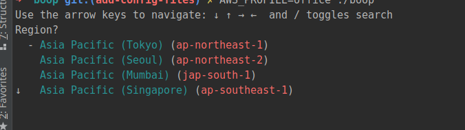
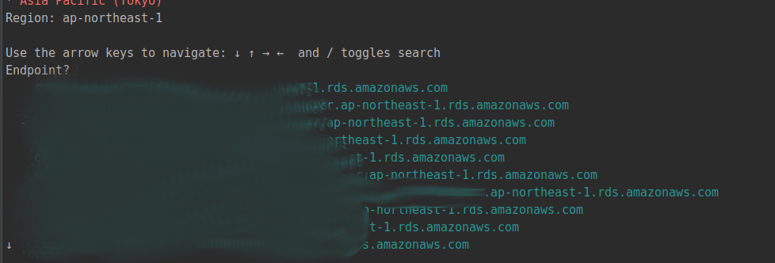
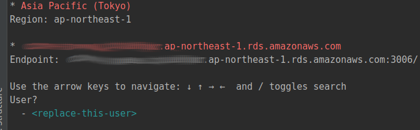

# Boop

## Features
* Generates RDS auth token
* Automatically copies generated token to clipboard

## Installing 
1. Run `go get github.com/dooven/boop `
    * Make sure you have the `$GOHOME/bin` added to your `PATH`
2. Run `boop` 
    * Optionally, you can pass in the `AWS_PROFILE` e.g. `AWS_PROFILE=personal boop`
    
## Demo
1. Pick the region  
2. Pick the RDS endpoint  
3. Pick the RDS User  
4. The token will be generated, and will be copied to your clipboard

